<div align="center">



# Tavily Search Agent Skill

**Portable web search for OpenClaw and other Agent Skills-compatible agents.**

[](https://clawhub.ai/jacky1n7/skills/openclaw-tavily-search)
[](https://agentskills.io)
[](https://www.python.org/)
[](LICENSE)

通过 Tavily API 为 Agent 提供结构化网页检索。保留 OpenClaw 原生安装体验，同时遵循
Agent Skills 开放格式，可被其他兼容客户端复用。

</div>

## Why this skill

- Returns compact URLs and snippets instead of forcing an agent to parse a search page.
- Supports stable JSON for tool chains and Markdown for human review.
- Covers general, news, and finance search with time and domain filters.
- Uses only the Python standard library; `certifi` is an optional TLS fallback when already installed.
- Keeps successful output on stdout and actionable diagnostics on stderr.
- Never disables TLS verification and never writes the Tavily API key to output.

Search results are discovery data, not final evidence. The skill instructs agents to open relevant
sources, prefer primary material, and cite the pages that support their claims.

## Install

### OpenClaw

Install the current ClawHub package:

```bash
openclaw skills install @jacky1n7/openclaw-tavily-search
```

[View the package on ClawHub](https://clawhub.ai/jacky1n7/skills/openclaw-tavily-search)

### Other compatible agents

The distributable `tavily-search/` directory follows the [Agent Skills specification](https://agentskills.io/specification).
Use the client's normal GitHub/Agent Skills installer and select `tavily-search`, or place the
`tavily-search/` directory in the client's standard skills location.

One commonly supported installer is:

```bash
npx -y skills add Jacky1n7/openclaw-skill-tavily-search --skill tavily-search
```

Clients that cannot load Agent Skills can still call `tavily-search/scripts/tavily_search.py` as a regular
CLI. Portability requires Python 3.9+, outbound HTTPS access, and support for either loading a
`SKILL.md` directory or invoking the script; it does not mean every Agent product works without an
integration mechanism.

## Configure

Create a Tavily API key and expose it to the Agent process:

```bash
export TAVILY_API_KEY="tvly-..."
```

OpenClaw users may alternatively put `TAVILY_API_KEY=...` in `~/.openclaw/.env`. Keep the key out of
prompts, logs, screenshots, and committed files. Search queries and domain filters are sent to
Tavily.

For a custom trusted CA bundle, set the standard `SSL_CERT_FILE` environment variable. The script
also retries certificate verification with `certifi` when that package is already available; it
never falls back to an unverified TLS connection.

## Use

Run paths relative to the skill directory:

```bash
# Stable structured output for agents
python3 tavily-search/scripts/tavily_search.py \
  --query "portable Agent Skills specification" \
  --max-results 5 \
  --format brave

# News from the last week
python3 tavily-search/scripts/tavily_search.py \
  --query "AI agent platform releases" \
  --topic news \
  --time-range week \
  --format brave

# Restrict source domains
python3 tavily-search/scripts/tavily_search.py \
  --query "Tavily Search API authentication" \
  --include-domain docs.tavily.com \
  --format md
```

Search depths: `basic`, `advanced`, `fast`, `ultra-fast`. Advanced search uses more Tavily credits.
Topics: `general`, `news`, `finance`. Repeat `--include-domain` or `--exclude-domain` to pass more
than one domain.

## Output

- `raw`: `{query, answer?, results:[{title,url,content,score?}]}`
- `brave`: `{query, answer?, results:[{title,url,snippet,score?}]}`
- `md`: compact numbered links with snippets

The default result count is 5 and the accepted range is 1-20. Responses larger than 2 MiB are
rejected before parsing.

## Development

```bash
python3 -m unittest discover -s tests -v
python3 scripts/build_dist.py
python3 scripts/build_dist.py --check
```

`scripts/build_dist.py` creates deterministic `dist/tavily-search.skill` and manifest files from
the canonical `tavily-search/` directory. CI verifies Python 3.9 and 3.12 on Linux, macOS, and Windows.

## License

Source code in this repository is available under the [MIT License](LICENSE). ClawHub-hosted copies
are additionally distributed under ClawHub's registry terms.
